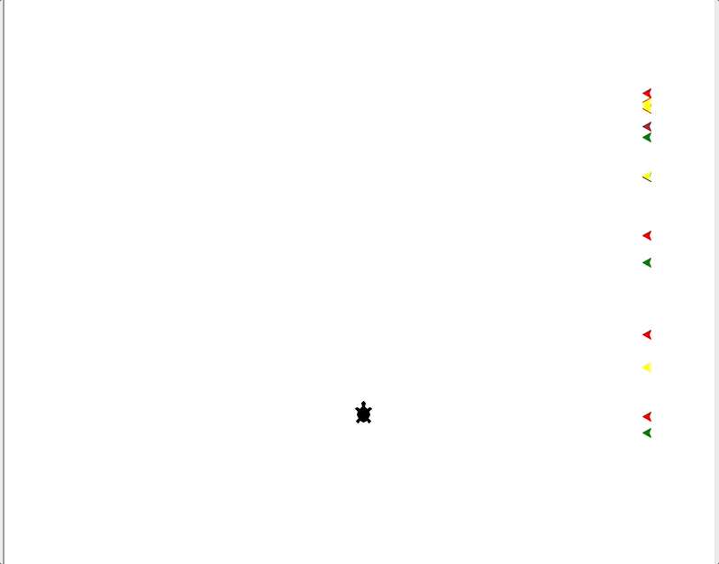
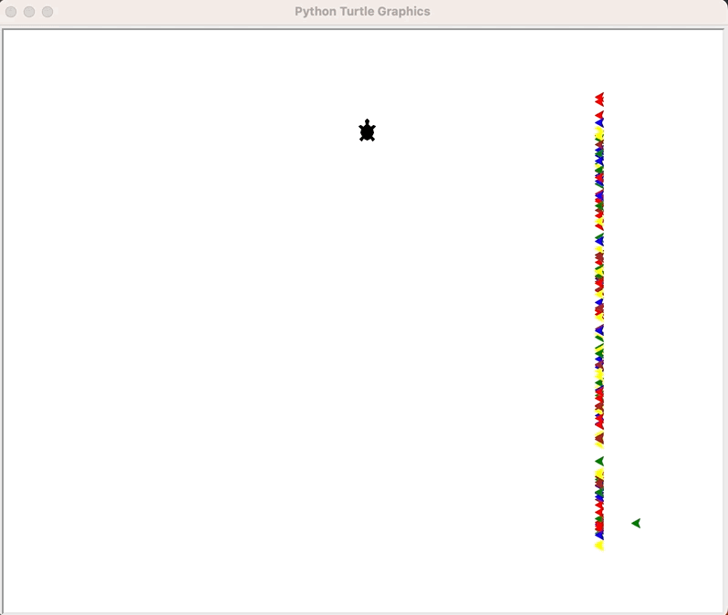
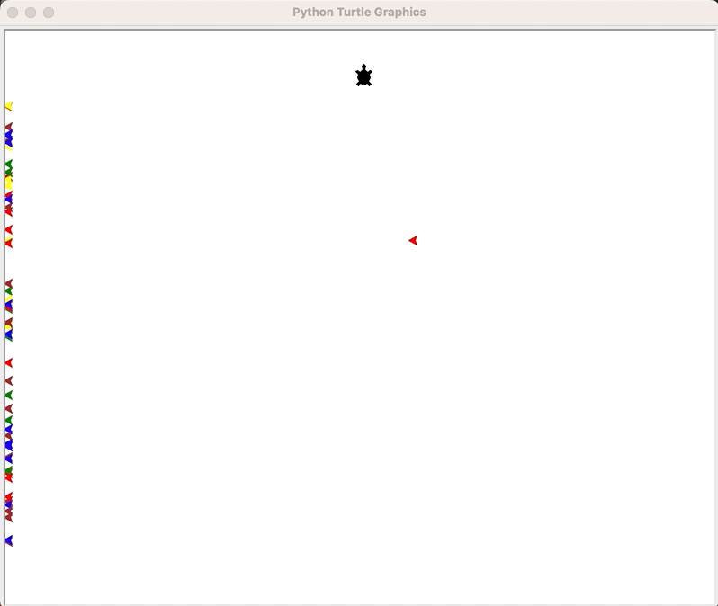
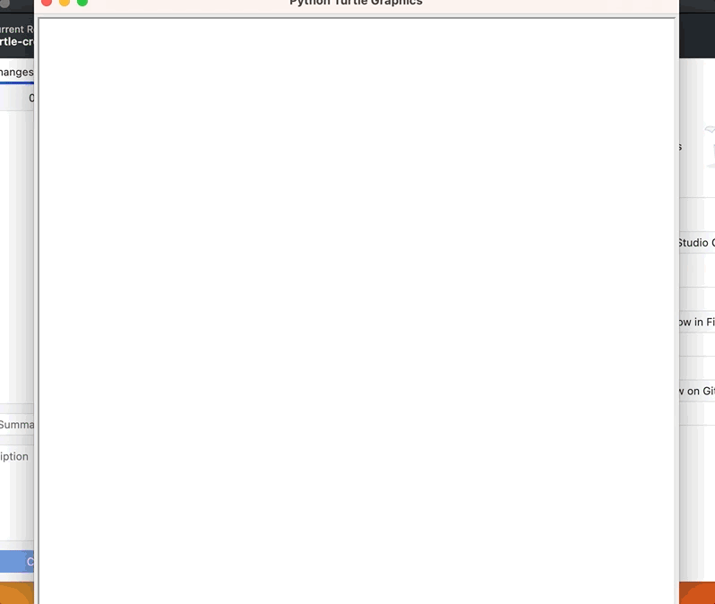
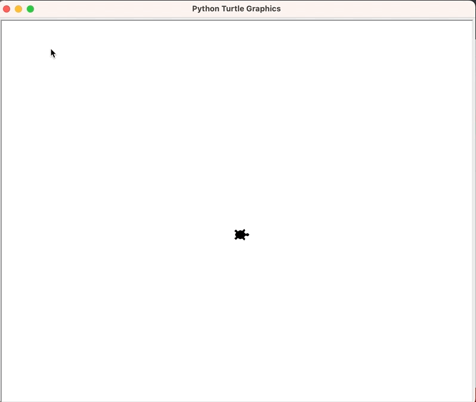
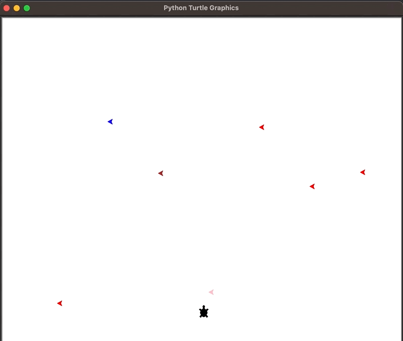
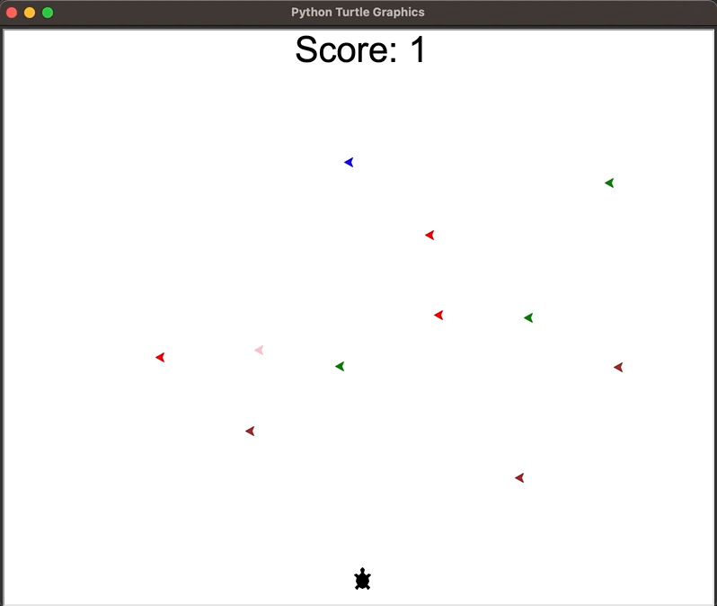
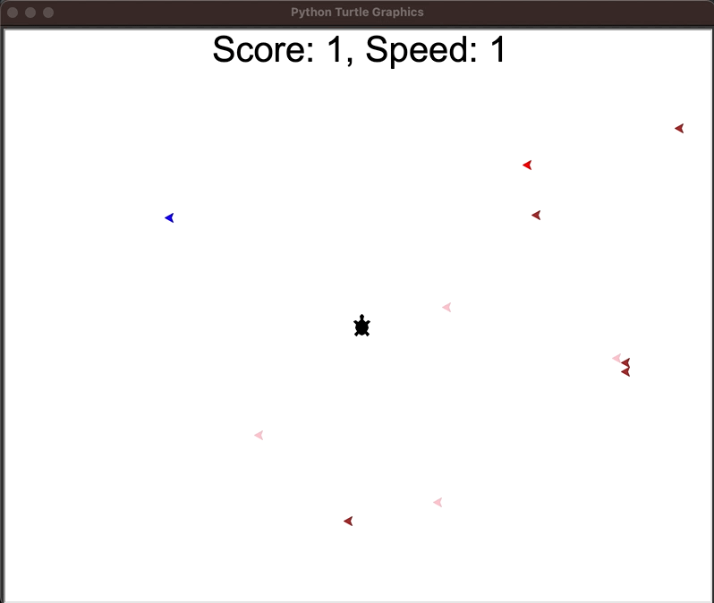
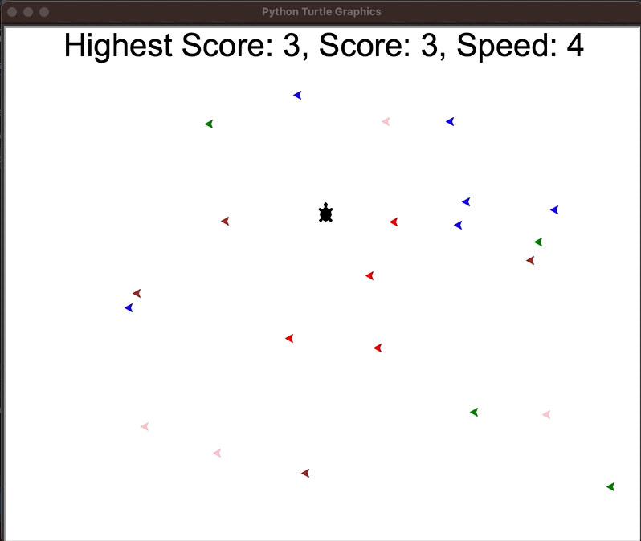

<a name="readme-top"></a>


<div align="center">
<!-- Title: -->
<h1><a href="https://github.com/skthati/turtle-crossing/">Turtle Crossing</a> - Python Turtle </h1>
</div>

<!-- Table of contents -->
<hr>
<hr>
<ol>
    <li><a href="#pong-game">Turtle Crossing Game</a></li>
    <li><a href="#bloopers">Bloopers</a></li>
</ol>
<hr>
<hr>

## Bloopers <a name="bloopers"></a>
Worth to see 

Turtles not moving



Turtles going backwards




Superfast traffic



Traffic going on same axle after a while



Ghost logic. Turtle going to start position for no reason.



Working Traffic crash. 



Add Score Board



Traffic not clearing after collision.



Working Turtle -- Goes from bottom to top.
Working Traffic -- Traffic created every 10 iterations and gets deleted if Turtle collides with Traffic
Working ScoreBoard -- Score and speed are updated on every successful crossing of Turtle. Highest score is update only if score is greater than Higest score.




<p align="right">(<a href="#readme-top">back to top</a>)</p>
<hr>  


<!-- 

Test1  
## Test <a name="test"></a>
Test Test

1. Code
    ```Python
    sc.onkey(key="Up", fun=up_move)
    sc.onkey(key="Right", fun=right_move)
    sc.onkey(key="Left", fun=left_move)
    sc.onkey(key="Down", fun=down_move)
    ```

2. Output

    

<p align="right">(<a href="#readme-top">back to top</a>)</p>
<hr>  


-->
 
